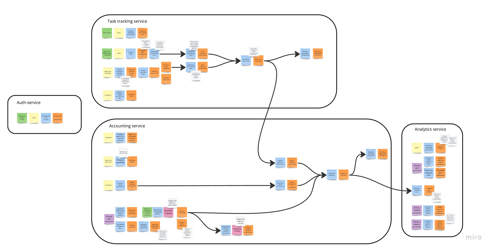
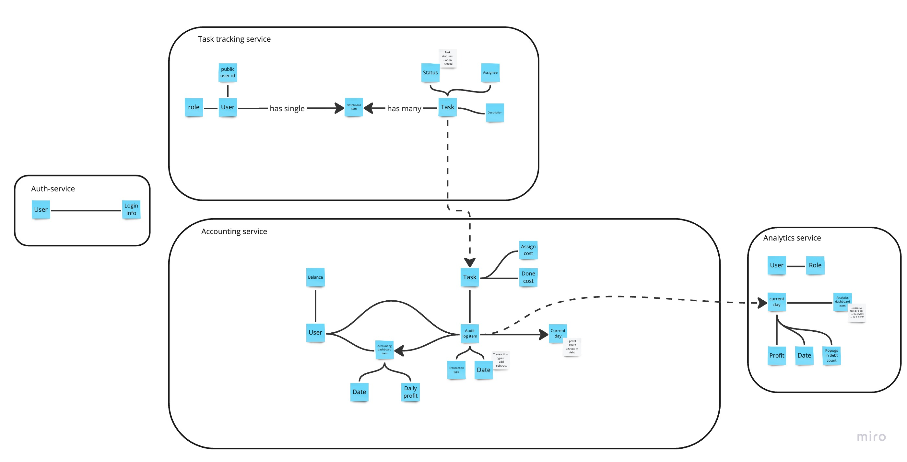

# Week one

## Event storming

### Business events

На самом деле прям бизнес событий в системе не так много
Нужно уметь:
- Залогиниться
- Создать таск
- Отметить таск выполненным
- Переасайнить таск (Big red button)
- Выплачивать деньги в конце дня

Остальное это плюс-минус технические шаги. Кстати о них

### CUD events
- Назначить исполнителя
- Переназначить исполнителя
- Списать деньги с исполнителя
- Начислить деньги исполнителю
- Отправить письмо с суммой выплаты

### Сервисы
Внутренние
- *ауф сервис*: не расписаны шаги по тому как пользователи попадают в систему, но это было пропущено преднамеренно
- *таск трэкинг сервис*
- *Бухгалтерский сервис (аккаунтинг)*
- *Аналитический сервис*

Внешние
- *золотая корва*: через неё проходят выплаты
- *бумажная корова*: через неё отправляются письма

## Данные 

Связанных сущностей получилось несколько
- **Пользователь**: хранит его Auth service, а связи есть во всех остальных и они не отображены на диаграме, чтобы её не захламлять
- **Таск**: хранит его, логично, Task tracking service
- **Audit log item**: связан нерушимой связью с пользователем и таском, хранится в Accounting service

### Направление бизнес эвентов
- Залогиниться: от ауф ко всем остальным
- Создать таск: от таск трекинг сервиса к аккаунтингу
- Отметить таск выполненным: от таск трекинг сервиса к аккаунтингу
- Переасайнить таск (Big red button): от таск трекинг сервиса к аккаунтингу
- Выплачивать деньги в конце дня: от таск аккаунтинга к таск трекинг сервису и аналитике

### Направление СОУ (создать, обновить, удалить) событий
- Назначить исполнителя: от таск трекинга в аккаунтинг
- Переназначить исполнителя: от таск трекинга в аккаунтинг
- Списать деньги с исполнителя: от аккаунтинга в аналитику
- Начислить деньги исполнителю: от аккаунтинга в аналитику и золотую корову
- Отправить письмо с суммой выплаты: от аккаунтинга в бумажную корову