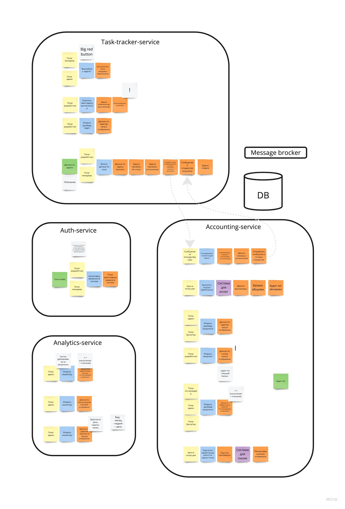

# Week zero

## Architecrure



### Structure

У меня получилось выделить 4 основных сервиса
1. Auth service - штука, которая умеет по фотке клюва (видимо со своим отдельным небольшим фронтендом для загрузки фотки) определять, что это за папуг и возвращать токен. Хочется использовать её во всех остальных сервисах примерно как oauth proxy
2. Task-tracker service – сервис, который знает про задачи, пользователей и дает менеджерам big red button – штуку для шафла задач между папугами
   1. "Заассайнить задачи" (Big red button) – рандомный шафл задач между папугами, списания повторяются 
   2. Отметить задачу как выполненную – отправляет запрос в акаунтинг на начисление денег
   3. (Для разработчиков) Дешборд с задачами
   4. Создание задачи – внесение описания, выбор исполнителя, запрос в аккаунтинг на генерацию стоимостей
3. Accounting service – сервис, занимающийся генерацией стоимостей, знает про аудит-лог – общий лог всех действий с задачами
   1. (Разработчик) Дешборд папуга с его счетами
   2. (Админ и бухгалтер) Дешборд с аудит-логом
   3. (Топ и админ) Дешборд с заработком топов
   4. Расчет стоимостей (списания и начисления) по задаче
   5. Крон для зачисления
   6. Выплаты папугам через сторонний сервис *
   7. Отссылка писем папугам через сторонний сервис *
4. Analytics service – сервис с аналитикой по аудит-логу, не пишет в него, а только читает. Ходит в него только админ
   1. Дешборд с заработком топов – чистый клон функциональности из акаутинга
   2. Данные по числу папугов в минусе
   3. Данные по самым дорогим задачам за период в формате
      1. Month 01 - 28$
      2. ...
      3. Week 1-01 - 28$
      4. ...
      5. 02.01.2023 - 23$
      6. 01.01.2023 - 28$

Пока что кажется, что каждый сервис должен иметь отдельный фронтенд. Коммуникации между сервисами полагаются асинхронными через message-broker

### Communications

#### Auth service
- GET /auth – получение токена по фотке клюва

#### Task-tracker service
- GET /tasks – получение списка задач
- POST /tasks/big_red_button – заассайнить задачи
- PUT /tasks/update – обновление статуса задачи
- POST /tasks/create – создание задачи

Сущность задачи
```json
{
  "id": "uuid",
  "description": "string",
  "assignee": "uuid",
  "fee": "number",
  "cost": "number",
  "status": "enum" // init, in_progress, done
}
```

#### Accounting service
- GET /accounting/payrolls – получение списка счетов папуга
- GET /accounting/generate/costs – генерация стоимостей по задаче
- GET /accounting/log – получение данных по аудит логу
- GET /accounting/ballance/top – получение данных по заработку топов
- POST /accounting/payroll/payout – зачисление денег на счет папуга через сторонний сервис
- POST /accounting/payroll/send – отправка письма папугу через сторонний сервис

Сущность лога
```json
{
  "id": "uuid",
  "date": "date",
  "task": "uuid",
  "assignee": "uuid",
  "fee": "number",
  "cost": "number",
  "status": "enum" // init, in_progress, done
}
```

#### Analytics service
- GET /analytics/top – получение данных по заработку топов
- GET /analytics/sub_zero – получение данных по папугам в минусе
- GET /analytics/expensive_tasks – получение данных по самым дорогим задачам